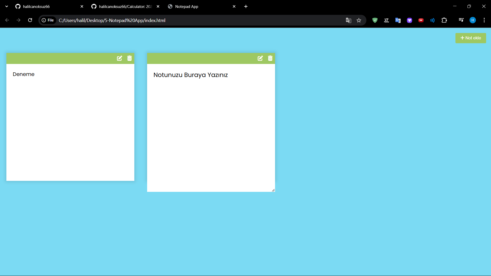

# Notepad
 2023

## 📸 Ekran Görüntüleri

### Ana Sayfa


## 📦 Kurulum

1. Bu projeyi bilgisayarınıza indirin veya bir Git deposuna klonlayın:
   ```bash
   git clone https://github.com/halilcanoksuz66/Notepad.git
   cd Notepad

Tarayıcıda açmak için:

```sh
index.html dosyasını tarayıcıda açın
```

**📩 İletişim**

Eğer herhangi bir sorunuz veya geri bildiriminiz varsa, benimle iletişime geçmekten çekinmeyin!
